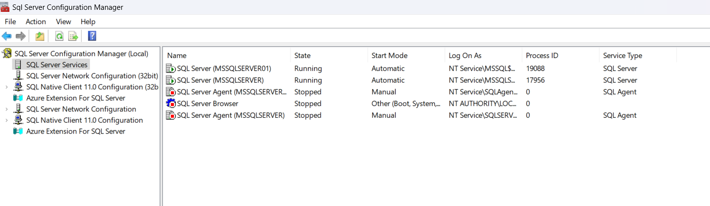
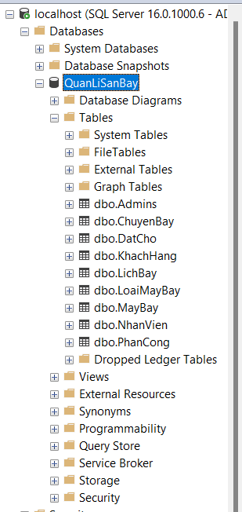
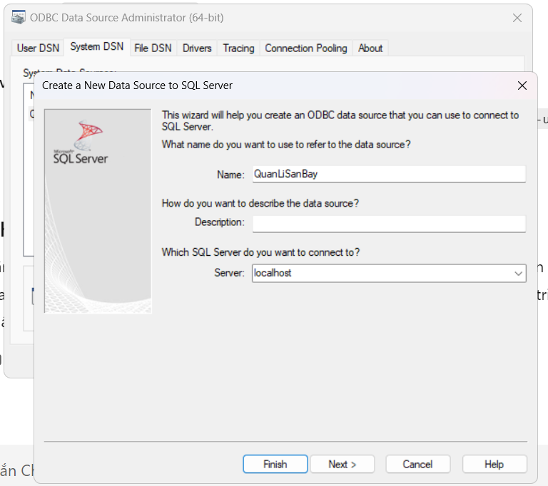
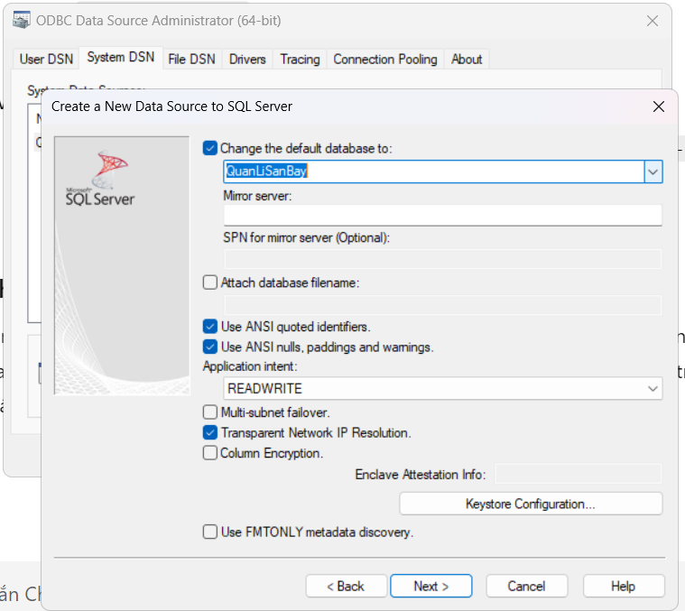
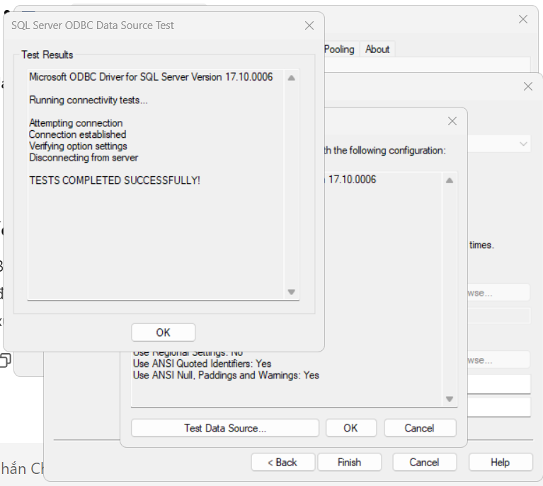
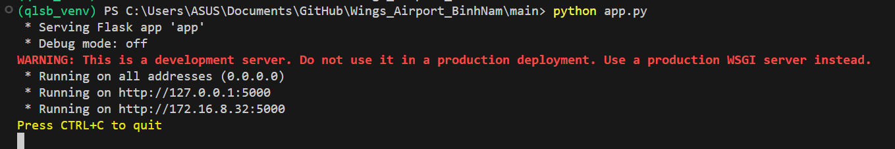
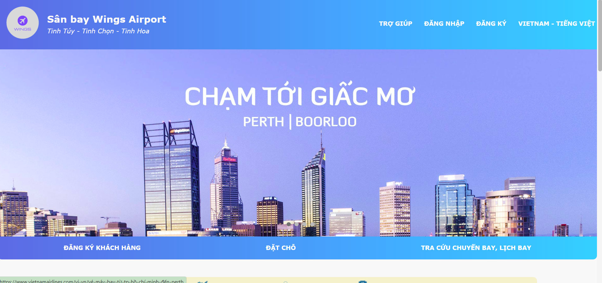

# 1.1. Tổng quan về sân bay Wings Airport

https://youtu.be/diddub_jWAM?si=4pPiAdezpXkX1kUP

Sân bay quốc tế Wings Airport hướng đến là một sân bay thật sự trong hệ thống giao thông hàng không của Việt Nam. Với số lượng hành khách ngày càng tăng, và các chuyến bay [nội địa/quốc tế] được khai thác thường xuyên, Wings Airport của chúng em ra đời đang phải đối mặt với nhiều thách thức:

- **Đảm bảo an ninh, an toàn:** Hệ thống an ninh, an toàn phải được kiểm soát chặt chẽ và hiệu quả.
- **Nâng cao chất lượng dịch vụ:** Wings Airport phải không ngừng nâng cao chất lượng dịch vụ, mang đến sự hài lòng cho hành khách.
- **Tối ưu hóa hoạt động:** Quản lý hiệu quả nguồn lực, nhân sự và thông tin.

# 1.2. Lý do chọn đề tài

Việc lựa chọn đề tài "Xây dựng website quản lý sân bay Wings Airport" của chúng em được xem xét dựa trên những lý do sau:

- **Thứ nhất, nhu cầu thực tế**
- **Thứ hai, tính ứng dụng cao**
- **Thứ ba, phù hợp với năng lực**

# 1.3. Mục tiêu của dự án

Dự án "Xây dựng website quản lý sân bay Wings Airport" được thực hiện với mục tiêu: Xây dựng một hệ thống website cơ bản, hiệu quả, đáp ứng nhu cầu quản lý và vận hành cơ bản của sân bay mô phỏng Wings Airport.

Để đạt được mục tiêu tổng quát, dự án tập trung vào các mục tiêu cụ thể sau:

**Đối với chúng em:**

- Cung cấp hệ thống xử lý thông tin, hạn chế sai sót trong quá trình vận hành.
- Áp dụng kiến thức môn học và kỹ năng đã học vào thực tế.
- Là tiền đề cho các nghiên cứu, phát triển và ứng dụng công nghệ thông tin trong lĩnh vực quản lý sân bay trong tương lai.

**Đối với người sử dụng Wings Airport:**

- Cung cấp thông tin: Website cung cấp đầy đủ thông tin về chuyến bay, lịch bay,.. cho hành khách tra cứu một cách dễ dàng, thuận tiện.
- Nâng cao trải nghiệm của hành khách: Hỗ trợ hành khách thực hiện các thủ tục trực tuyến (đặt vé, check-in,...).

# 1.4. Phạm vi và giới hạn của dự án

## 1.4.1. Phạm vi

**Đối tượng phục vụ:** Website quản lý sân bay Wings Airport hướng đến phục vụ:

- **Quản trị viên:** Là những người có quyền hạn cao nhất, quản lý toàn bộ hệ thống và dữ liệu của website.
- **Hành khách:** Là những người sử dụng website để tra cứu thông tin, sử dụng các dịch vụ của sân bay, ví dụ: tra cứu chuyến bay, đặt vé máy bay,...

**Chức năng:** Website cung cấp các chức năng chính bao gồm:

- **Đối với quản trị viên:** Quản lý thông tin chuyến bay, quản lý nhân viên, quản lý tài khoản, thống kê báo cáo,...
- **Đối với hành khách:** Tra cứu thông tin chuyến bay, đặt vé máy bay, check-in online, sử dụng các dịch vụ, gửi phản hồi,...

## 1.4.2. Giới hạn

Do hạn chế về mặt thời gian, nguồn lực và kiến thức, dự của chúng em, bài tập lớn này có những giới hạn nhất định:

- Nhiều ràng buộc, trường hợp sử dụng dữ liệu chưa được xử lí hay lường đến.
- Dữ liệu được sử dụng trong quá trình xây dựng và demo hệ thống là dữ liệu mô phỏng.

Mặc dù còn nhiều hạn chế, nhưng chúng em đã cố gắng hết sức để hoàn thành tốt nhất các mục tiêu đề ra, đồng thời đảm bảo tính thực tiễn và khả năng ứng dụng của đề tài.


# 1.5. Hướng dẫn sử dụng

## 1.5.1. Cài đặt SSMS, DSN, Postman, Python

Tìm kiếm Google, đảm bảo chạy đầy đủ trước khi làm các bước tiếp

## 1.5.2. Cài đặt CSDL

### Bước 1:
Chạy Sql Sever Configuration Manager
Nhấn "SQL Sever Services"
Kiểm tra xem 2 dòng đầu đang Running hay Stopped, Stopped thì chuột phải ấn Run



### Bước 2:
Chạy SSMS
Connect sever: 
- Sever name: Localhost
- Authen: Giữ nguyên
- Tick vào "Trust sever.."
Ấn Connect:

### Bước 3:
Nhấn "New Query"
Trong Main \ Query SQL \ Dán lần lượt QuanLiSanBay.sql ; insert... 
Cho chạy từng dòng, khéo không lỗi



## 1.5.3. Cài đặt DSN

### Bước 1:
Tìm ODBC Data Source 32/64bit -> System DSN -> Add -> ODBC Driver .. for SQL Sever 

Name: Đặt tên
Des..: Bỏ qua
Sever: localhost



### Bước 2:
Next -> Next
Tick ô "Change the default.."
Mũi tên xuống
Chọn QuanLiSanBay



### Bước 3:
Next -> Next
Test Data Source...
Test Complete succ.. là xong



Bấm Finish

## 1.5.4. Chạy Project

### Bước 1.
- Mở dự án trong IDE, ví dụ VSCode
- Bật terminal
- Chạy ``` qlsb_venv\Scripts\activate ``` 
- Chạy ``` cd main ```
- Chạy ``` pip install -r requirements.txt ```
- Chạy ``` python app.py ``` và truy cập theo địa chỉ ```localhost:5000``` hoặc ```127.0.0.1:5000``` hoặc ```{ip_của_mày}:5000``` để chạy



---

